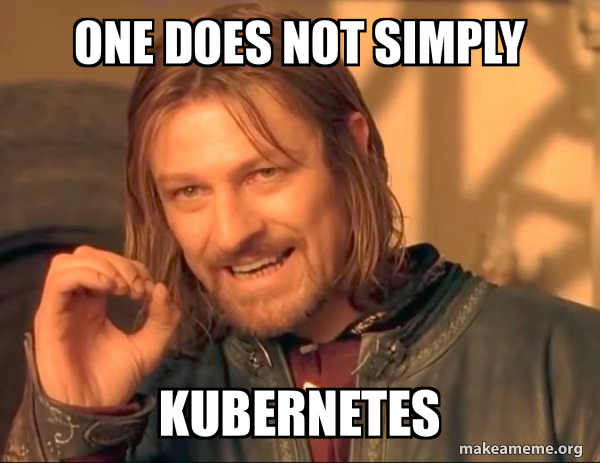

# Here be my Kubernetes homelab repo
Very tinker, much learn

Anthropic's Claude model has written the vast majority of the code in this repo. Any documentation it wrote will be left intact. It knows a lot more about this stuff than I do!

The Kubernetes cluster itself is comprised of 2x HP EliteDesk thin clients running k3s on Ubuntu Server in a single server-agent configuration. A Synology NAS is also attached to the cluster for shared storage. The aformentioned hardware sits behind a router so as to segregate it from the rest of the LAN.  

GitOps is practiced via Flux so that all cluster configuration is done declaratively instead of running individual commands.

The conjob.yaml file in `dev/airthings` references the [airthings-pg repo](https://github.com/rhprasad0/airthings-pg), which is a demonstration of a CI/CD pipeline. Pushes to the main branch in that repo are automatically deployed to the cluster.

Tailscale is up and running on the cluster with an exit node configured so as to act as a pseudo VPN. Saves money if a VPN service is needed for security reasons while on the go.  