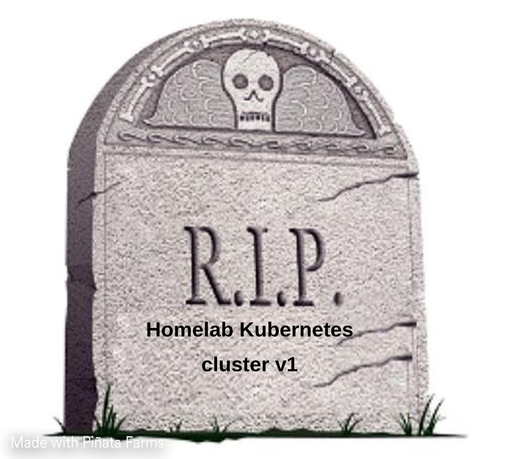

# Here be my Kubernetes homelab repo
Very tinker, much learn

The cluster itself is comprised of 2x HP EliteDesk thin clients running k3s on Ubuntu Server in a single server-agent configuration. 

Currently in the process of learning GitOps via Flux.